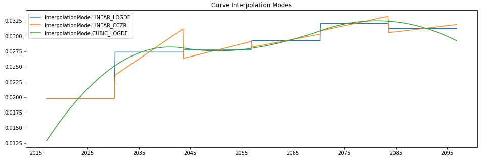
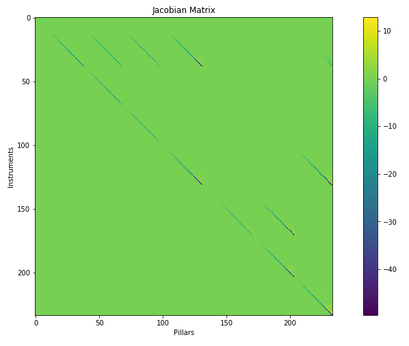
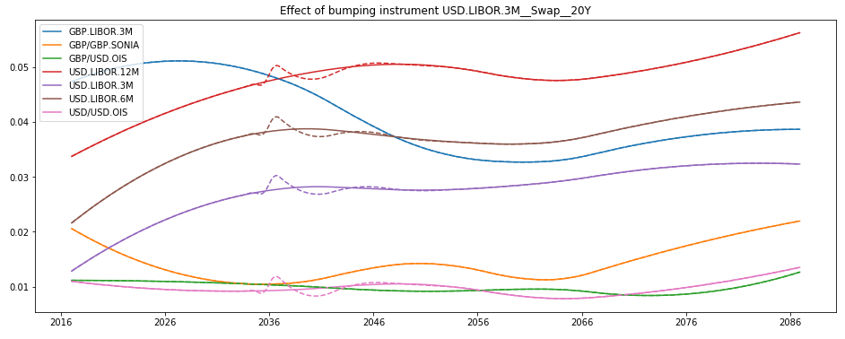

# PYBOR
PYBOR is a multi-curve interest rate framework and risk engine based on multivariate optimization techniques, written in Python.

Please refer to the [Jupyter notebook](main.ipynb) for the overview of main features.

## Features
* Modular structure allows to define and plug-in new market instruments.
* Based on multivariate optimization, no bootstrapping.
* Supports arbitrary tenor-basis and cross-currency-basis relationships between curves, as long as the problem is properly constrained.
* Risk engine supports first-order (Jacobian) approximation to full curve rebuild when bumping market instruments.
* Supports the following curve optimization methods:
    * Linear interpolation of the logarithm of discount factors (aka piecewise-constant in forward-rate space)
    * Linear interpolation of the continuously-compounded zero-rates
    * Cubic interpolation of the logarithm of discount factors

## Curve naming conventions
For the purpose of this project, the curves are named in the following way:

##### Projection curves
* **USD.LIBOR.3M** refers to USD BBA LIBOR reference rate with 3 month tenor
* **GBP.SONIA** refers to overnight GBP SONIA compound reference rate
* **USD.OIS** refers to overnight USD Federals Fund compound reference rate

##### Mono-currency discounting curves
In a mono-currency context, the reference rates above can be used also for discounting (e.g. **USD.OIS** curve used for discounting of collateralised USD trades and **USD.LIBOR.3M** curve for discounting of unsecured USD trades).

##### Cross-currency discounting curves
In a cross-currency context, the naming convention for discounting curves is as follows:

    <CurrencyOfCashFlow>/<RatePaidOnCollateral>

Few examples:

* **USD/USD.OIS** Discounting curve for USD cash-flows of a trade which is collateralised in USD, paying collateral rate linked to USD.OIS. Names USD/USD.OIS and USD.OIS refers to the same curve.
* **GBP/GBP.SONIA** Discounting curve for GBP cash-flows of a trade which is collateralised in GBP, paying collateral rate linked to GBP.SONIA. Names GBP/GBP.SONIA and GBP.SONIA refers to the same curve.
* **GBP/USD.OIS** Cross-currency discounting curve for GBP cash-flows of a trade which is collateralised in USD, paying collateral rate linked to USD.OIS.

## Screenshots

### Interpolation

Illustration of different interpolation modes which are supported by PYBOR:

### Jacobian Risk

First-order risk (instrument-to-curve pillar sensitivity) which is used to transform risk views.

### Curve Risk

Effect of bumping 20Y Libor 3M Swap rate on different curves:

## TODO
* Automatic resolution of solve stages for global optimizer
* Proper market conventions (day count and calendar roll conventions)
* Smoothing penalty functions
* Risk transformation between different instrument ladders
* Split-curve interpolators (different interpolation method for short-end and long-end of the curve)
* Jacobian matrix calculation via AD (performance gain)
